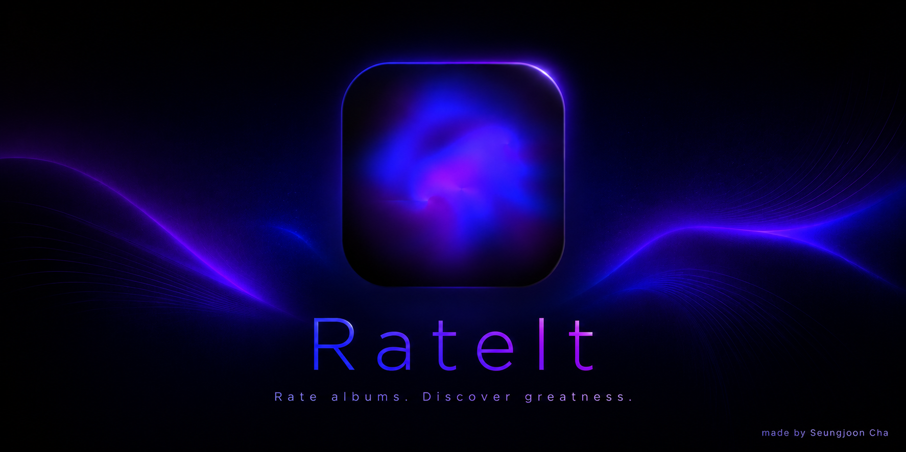
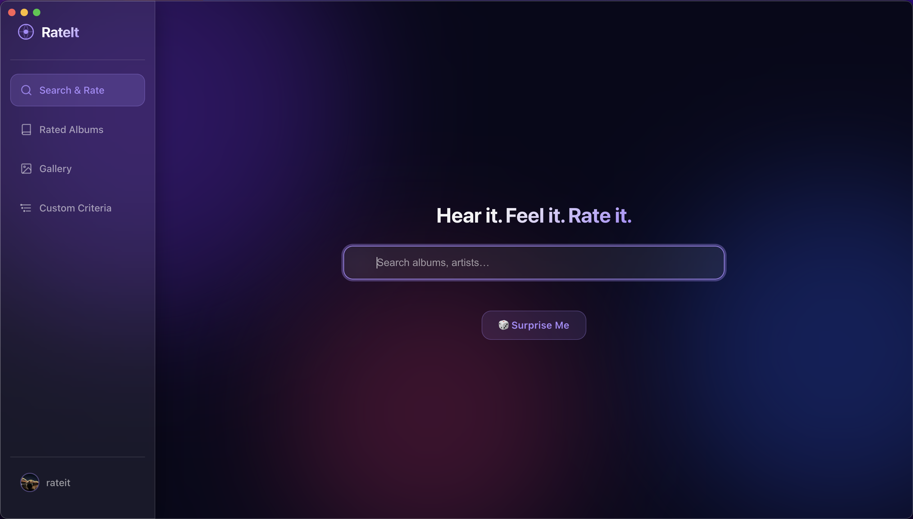
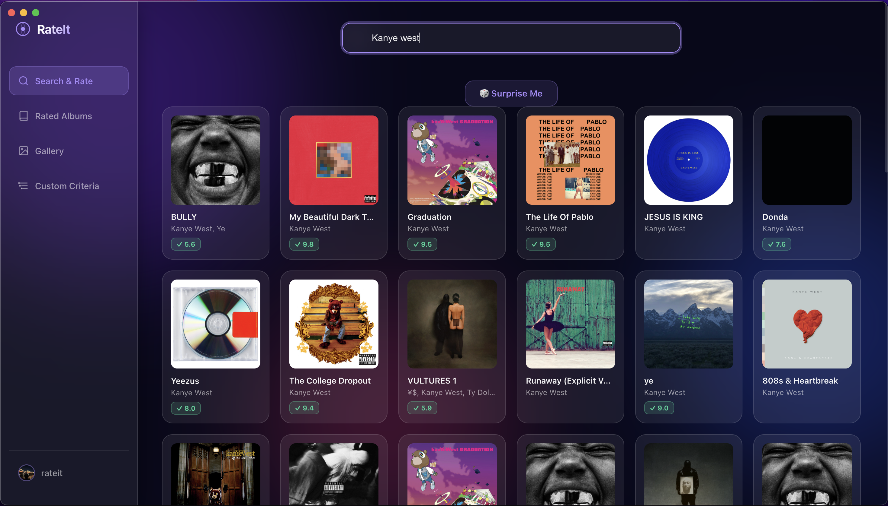
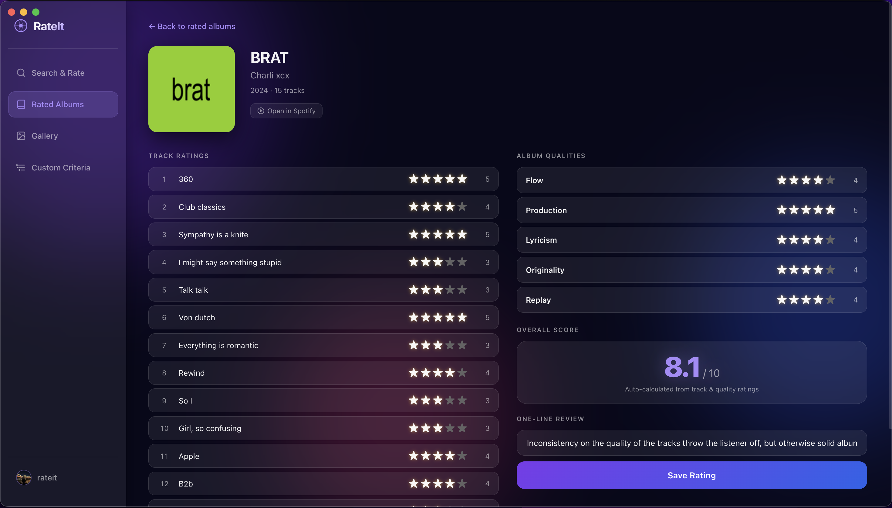
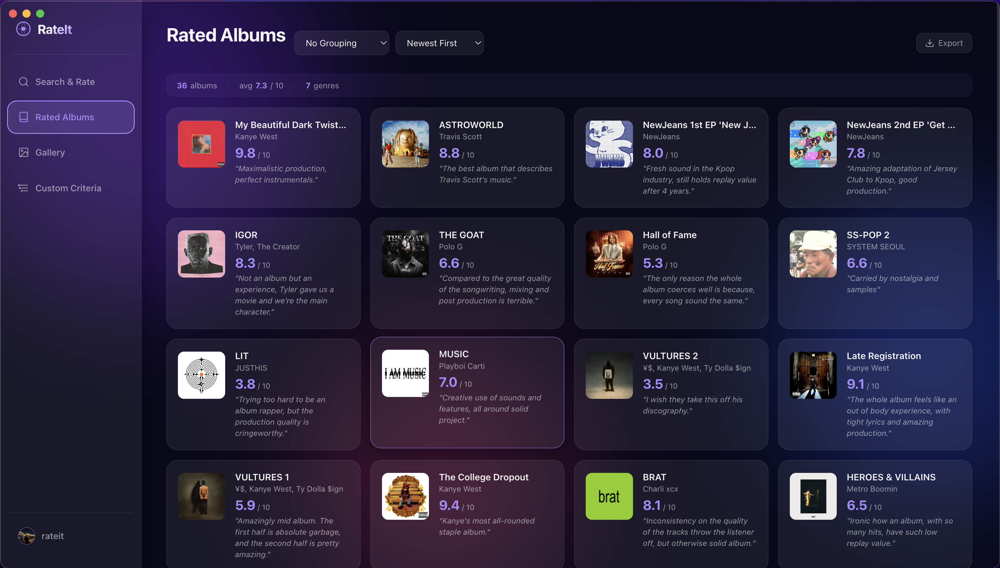
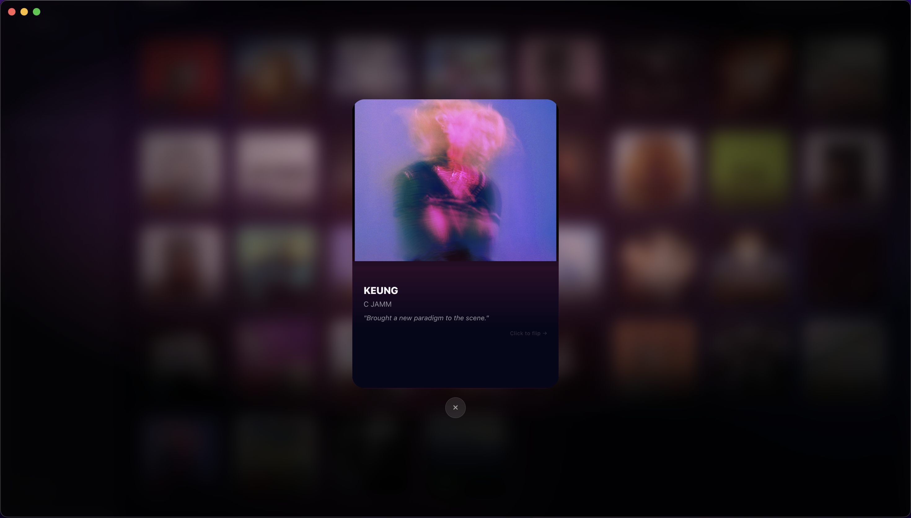
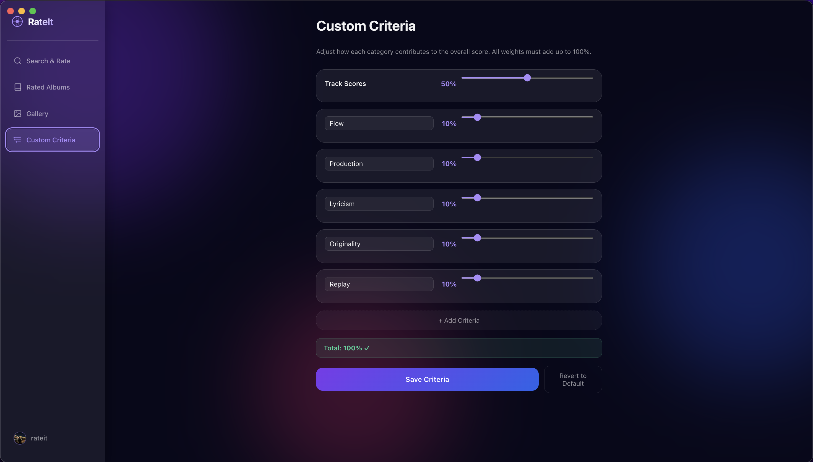
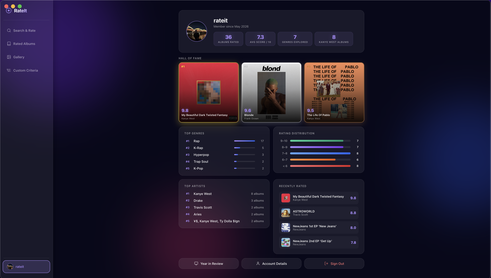
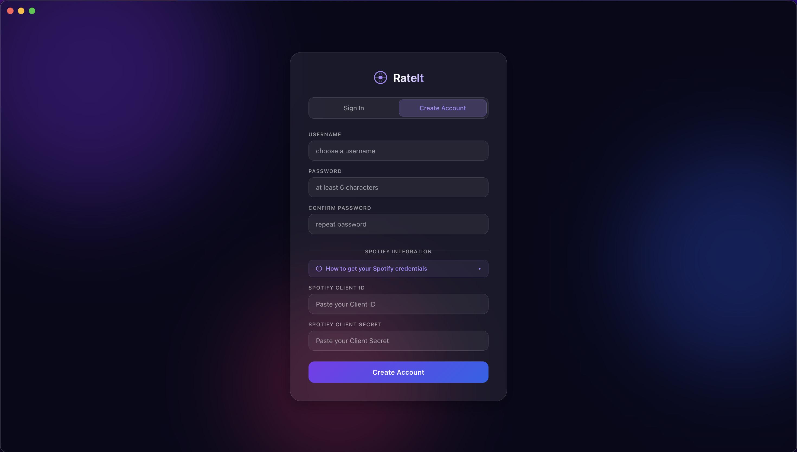

# RateIt - Your own local music rating app



**Rate your music. Own your taste.**

RateIt is a macOS desktop app for rating and cataloguing every album you listen to.

Search any album from Spotify API, rate it track-by-track and across five quality criteria (or your own!), and build a personal library that reflects your actual taste — no cloud, no subscription. Everything lives locally on your Mac.




---

## Table of Contents

- [Features](#features)
- [Requirements](#requirements)
- [Installation](#installation)
- [Setup: Spotify API credentials](#setup-spotify-api-credentials)
- [Usage](#usage)
- [Project structure](#project-structure)
- [Tech stack](#tech-stack)
- [Contributing](#contributing)
- [License](#license)

---

## Features

- **Search & Rate** — Find any album via the Spotify API and rate each track (1–5 ★) plus five quality criteria: Flow, Production, Lyricism, Originality, Replay. The overall score (out of 10) calculates automatically.



- **Rated Albums** — Your full library with sort (score, date) and group (artist, genre) controls, a mini stats bar, and one-click export.



- **Gallery** — A visual card grid of everything you've rated. Each card extracts the album's dominant colour and applies it as a theme. Click a card to expand it; click again to flip it and see the full score breakdown.




- **Custom Criteria** — Rename or reweight the five scoring dimensions so the formula fits how you actually listen (jazz, classical, electronic — all different).



- **Year in Review** — Annual Wrapped-style stats: albums per month, avg score, top genre, most active month, highest and lowest rated album.



- **Surprise Me** — One-click random album picker in the main screen, weighted toward your top genres.

- **Export** — Download your library as JSON, CSV, or a self-contained styled HTML page.

- **Open in Spotify** — Deep-link any album straight into the Spotify app.

---

## Requirements

- **macOS** (Apple Silicon — arm64)

- A [Spotify Developer account](https://developer.spotify.com/dashboard) to search albums (no Spotify subscription required, free tier works)

- Node.js 18+ and npm (only if building from source)

---

## Installation

### Download (recommended)

Download the latest `RateIt-1.0.0-arm64.dmg` from the [**Releases**](../../releases) page, open it, and drag `RateIt` to your Applications folder.

### Build from source

```bash
git clone https://github.com/sjcsoftware/rateit.git
cd rateit
npm install
npm run rebuild   # recompiles SQLite for Electron's Node runtime
npm start         # launch in dev mode
npm run build     # produces dist/RateIt-1.0.0-arm64.dmg
```

---

## Setup: Spotify API credentials




The reason why RateIt has a sign up page is, each person need to add their own Spotify API credentials.

**RateIt does not connect your information to any type of server nor cloud in any way. Everything is managed locally (feel free to check the source code!)**

RateIt uses the Spotify API only to search albums and fetch track lists. Also, your ratings and library data never touch Spotify's servers.

1. Go to [developer.spotify.com/dashboard](https://developer.spotify.com/dashboard) and sign in with any Spotify account.
2. Click **Create App**. Name and description can be anything.
3. Set the Redirect URI to `https://localhost` (doesn't matter, put anything), check **Web API**, accept the Terms, and save.
4. From your app's settings page, copy the **Client ID** and click **View client secret** to reveal the **Client Secret**.

On first launch, RateIt will prompt you to create a local account and paste both values. They are stored in your local database — again, never transmitted.

---

## Usage

### Rating an album

1. Type any album name or artist in the **Search & Rate** bar. Results appear from Spotify.
2. Click an album — RateIt loads the full track list.
3. Rate each track from 1–5 stars.
4. Rate the five album qualities (Flow, Production, Lyricism, Originality, Replay) from 1–5 stars.
5. Optionally write a one-line review.
6. Hit **Save Rating**. Done.


### Gallery

The **Gallery** shows all your rated albums as cards with their album colour applied. Click any card to see it full-size. Click again to flip it — the back shows your complete score breakdown by dimension and top tracks.

### Surprise Me

Hit the **🎲 Surprise Me** button on the Search page for a random album recommendation drawn from your top genres. Great for when you can't decide what to listen to next.

### Custom Criteria

Open **Custom Criteria** from the left nav to adjust dimension weights via sliders. All weights must total 100%. You can also rename dimensions or add your own (e.g. swap "Lyricism" for "Technique" for instrumental albums).

### Exporting your library

In **Rated Albums**, click **Export** (top right) to save your library as:
- **JSON** — full fidelity, machine-readable
- **CSV** — opens in Numbers / Excel
- **HTML** — a styled personal music page ready to share or archive

---

## Project structure

```
rateit/
├── electron/       # Electron main process
│   └── main.js
├── frontend/       # UI (vanilla JS, no frameworks)
│   ├── index.html
│   ├── app.js
│   └── style.css
├── backend/        # Express server + SQLite
│   ├── server.js
│   └── .env.example
├── assets/         # App icon
└── package.json
```

Data is stored in `~/Library/Application Support/rateit/ratings.db` and persists across updates.

---

## Tech stack

| | |
|---|---|
| Shell | Electron 28 |
| Server | Express 5, better-sqlite3 |
| Frontend | Vanilla JS / CSS (zero dependencies) |
| Database | SQLite — fully local |
| Music data | Spotify Web API (search & metadata only) |

---

## Contributing

PRs are welcome. For significant changes, open an issue first to discuss the direction.

```bash
git checkout -b feature/your-feature
# make changes
git commit -m "feat: describe your change"
git push origin feature/your-feature
# open a pull request
```

---

## License

[MIT](LICENSE) © 2026 Cha Seungjoon
